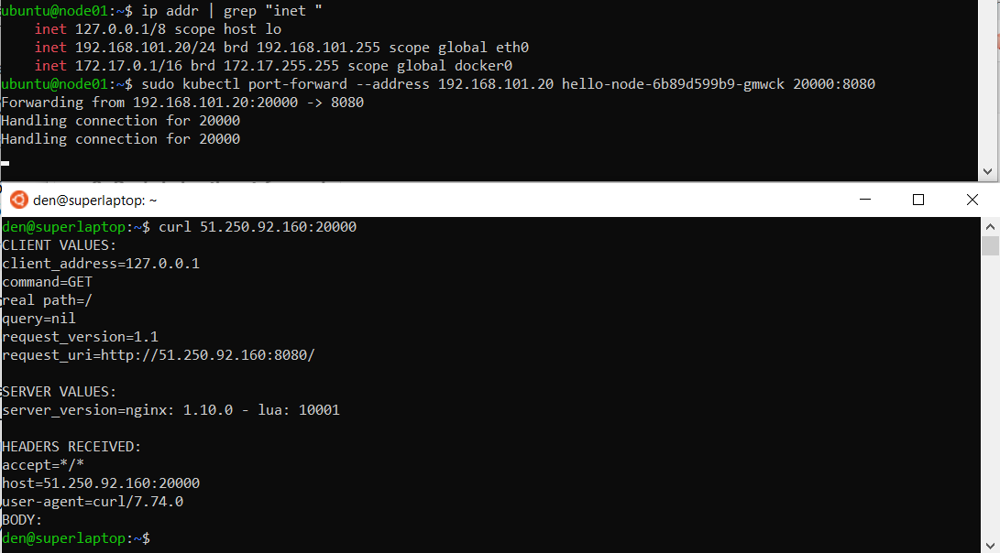

# 12.1. Компоненты Kubernetes


1) Установить Minikube


2) Запуск Hello World

- развернуть через Minikube тестовое приложение по туториалу
- установить аддоны ingress и dashboard


- Приложение доступно
```
  CLIENT VALUES:
  client_address=172.17.0.1
  command=GET
  real path=/
  query=nil
  request_version=1.1
  request_uri=http://51.250.92.160:8080/

  SERVER VALUES:
  server_version=nginx: 1.10.0 - lua: 10001

  HEADERS RECEIVED:
  accept=text/html,application/xhtml+xml,application/xml;q=0.9,image/webp,image/apng,*/*;q=0.8,application/signed-exchange;v=b3;q=0.9
  accept-encoding=gzip, deflate
  accept-language=ru,en;q=0.9,en-GB;q=0.8,en-US;q=0.7,de;q=0.6
  connection=keep-alive
  host=51.250.92.160:30214
  upgrade-insecure-requests=1
  user-agent=Mozilla/5.0 (Windows NT 10.0; Win64; x64) AppleWebKit/537.36 (KHTML, like Gecko) Chrome/101.0.4951.64 Safari/537.36 Edg/101.0.1210.47
  BODY:
  -no body in request-
```

- Установленные аддоны


3) Установить kubectl


Подготовить рабочую машину для управления корпоративным кластером. Установить клиентское приложение kubectl.

подключиться к minikube
проверить работу приложения из задания 2, запустив port-forward до кластера



