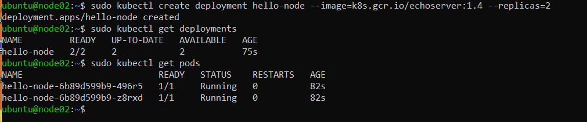
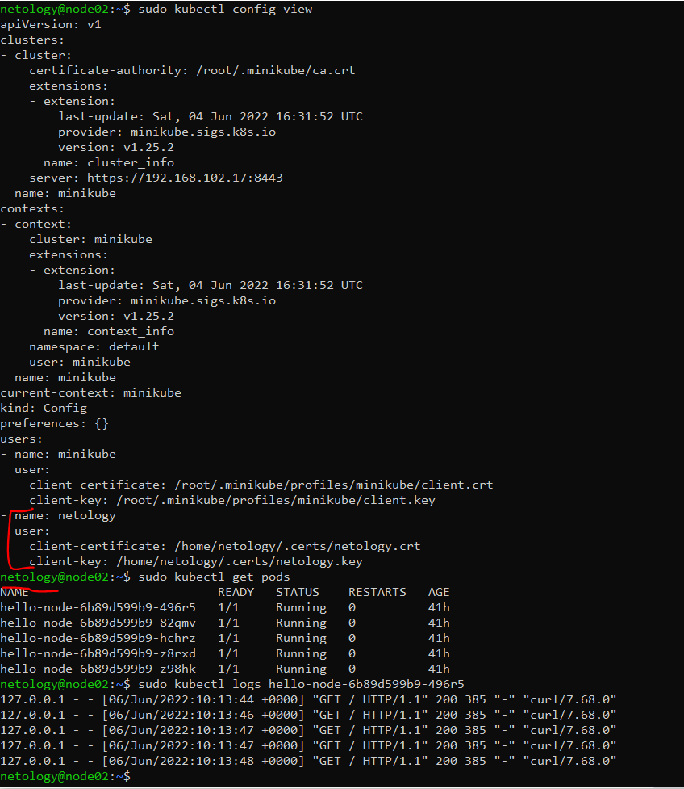
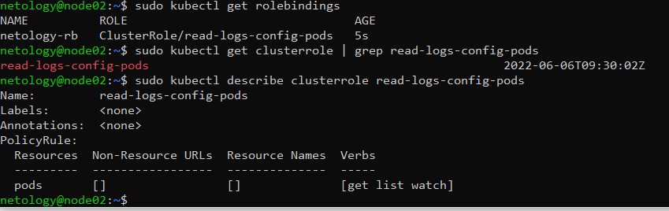
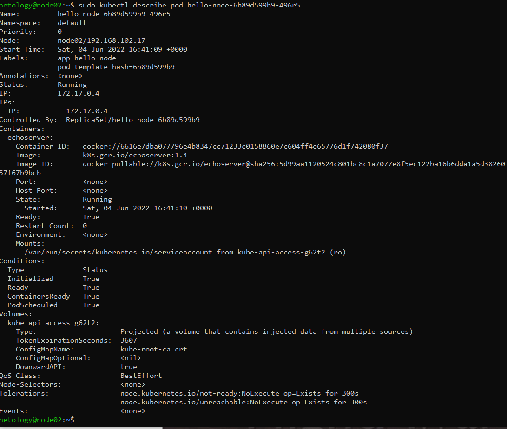
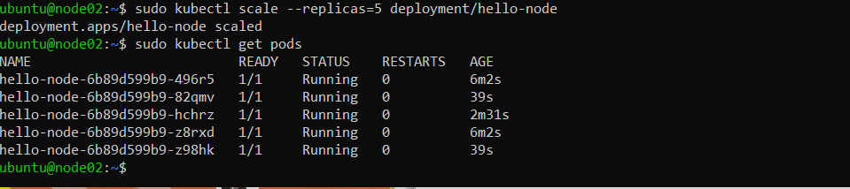

# 12.2 Команды для работы с Kubernetes

1) Требуется запустить деплоймент на основе образа из hello world уже через deployment. 
Сразу стоит запустить 2 копии приложения (replicas=2).

Требования:

- пример из hello world запущен в качестве deployment
- количество реплик в deployment установлено в 2
- наличие deployment можно проверить командой kubectl get deployment
- наличие подов можно проверить командой kubectl get pods

2) Требуется создать пользователя и выдать ему доступ на чтение конфигурации и логов подов в app-namespace.

Требования:

- создан новый токен доступа для пользователя
- пользователь прописан в локальный конфиг (~/.kube/config, блок users)
- пользователь может просматривать логи подов и их конфигурацию (kubectl logs pod <pod_id>, kubectl describe pod <pod_id>)

3) Установить kubectl

Необходимо изменить запущенный deployment, увеличив количество реплик до 5. Посмотрите статус запущенных подов после увеличения реплик.

Требования:

- в deployment из задания 1 изменено количество реплик на 5
- проверить что все поды перешли в статус running (kubectl get pods)

