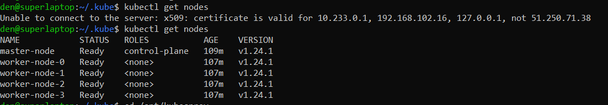

# 12.4 Развертывание кластера на собственных серверах, лекция 2

Задание 1: Подготовить инвентарь kubespray

Новые тестовые кластеры требуют типичных простых настроек. 
Нужно подготовить инвентарь и проверить его работу. Требования к инвентарю:

- подготовка работы кластера из 5 нод: 1 мастер и 4 рабочие ноды;
- в качестве CRI — containerd;
- запуск etcd производить на мастере.


Результат:

Для развертывания кластера kubernetes используем облако яндекс, terraform, kubespray

1. Устанавливаем kubespray в /opt/kubespray
2. Копируем папку /opt/kubespray/inventory/sample/group_vars в /kuber_deploy/inventory/prod/group_vars
3. Terraform разворачивает 5 нод в облаке яндекса.
```
  cd /kuber_deploy/terraform
  terraform apply
```
4. Terraform генерирует /kuber_deploy/inventory/prod/hosts.yml на основе ip-адресов из облака яндекса
5. Terraform запускает ansible-playbook c файлом /opt/kubespray/cluster.yml для установки kubernetes
6. Для организации доступа к кластеру с локального ПК выполняем следующие команды:
```
  rm /etc/kubernetes/pki/apiserver.*
  kubeadm alpha phase certs all --apiserver-advertise-address=0.0.0.0 --apiserver-cert-extra-sans=10.233.0.1,192.168.102.16,127.0.0.1,51.250.71.38
  systemctl restart kubelet
```
На скриншоте ниже приведена неудачная попытка подключения к кластеру и попытка после настроек.

