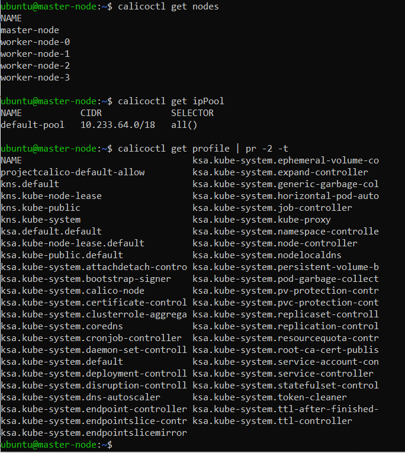

# 12.5 Сетевые решения CNI

После работы с Flannel появилась необходимость обеспечить безопасность для приложения. Для этого лучше всего подойдет Calico.

Задание 1: установить в кластер CNI плагин Calico
Для проверки других сетевых решений стоит поставить отличный от Flannel плагин — например, Calico. Требования:

установка производится через ansible/kubespray;
после применения следует настроить политику доступа к hello-world извне. Инструкции kubernetes.io, Calico

Задание 2: изучить, что запущено по умолчанию
Самый простой способ — проверить командой calicoctl get. 
Для проверки стоит получить список нод, ipPool и profile. Требования:

установить утилиту calicoctl;
получить 3 вышеописанных типа в консоли.

Выводы команды:



    Сгенерированный файл [hosts.yml](https://github.com/DennySim/devops_devkub/blob/main/12.4%20%D0%A0%D0%B0%D0%B7%D0%B2%D0%B5%D1%80%D1%82%D1%8B%D0%B2%D0%B0%D0%BD%D0%B8%D0%B5%20%D0%BA%D0%BB%D0%B0%D1%81%D1%82%D0%B5%D1%80%D0%B0%20%D0%BD%D0%B0%20%D1%81%D0%BE%D0%B1%D1%81%D1%82%D0%B2%D0%B5%D0%BD%D0%BD%D1%8B%D1%85%20%D1%81%D0%B5%D1%80%D0%B2%D0%B5%D1%80%D0%B0%D1%85%2C%20%D0%BB%D0%B5%D0%BA%D1%86%D0%B8%D1%8F%202/inventory/prod/hosts.yml)

```
  rm /etc/kubernetes/pki/apiserver.*
  kubeadm alpha phase certs all --apiserver-advertise-address=0.0.0.0 --apiserver-cert-extra-sans=10.233.0.1,192.168.102.16,127.0.0.1,51.250.71.38
  systemctl restart kubelet
```
