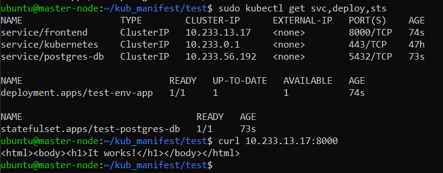
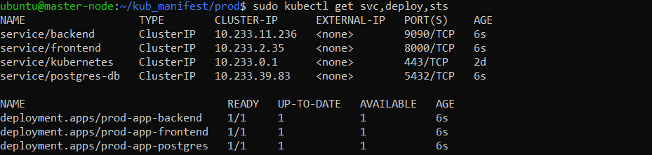
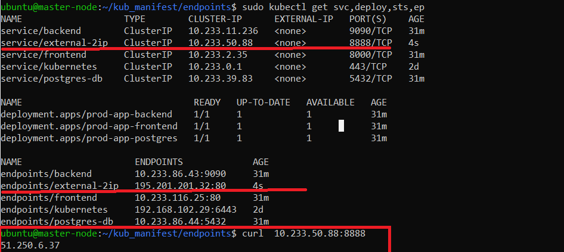

# 13.1 контейнеры, поды, deployment, statefulset, services, endpoints

Настроив кластер, подготовьте приложение к запуску в нём. Приложение стандартное: бекенд, фронтенд, база данных. 
Его можно найти в папке 13-kubernetes-config.

Задание 1: подготовить тестовый конфиг для запуска приложения
Для начала следует подготовить запуск приложения в stage окружении с простыми настройками. Требования:

- под содержит в себе 2 контейнера — фронтенд, бекенд;
- регулируется с помощью deployment фронтенд и бекенд;
- база данных — через statefulset.


Манифесты:  
[test_statefulset.yml](kub_manifest/test/test_statefulset.yml)
```
---
apiVersion: v1
kind: Service
metadata:
  name: postgres-db
  labels:
    app: test-db
spec:
  type: ClusterIP
  ports:
    - targetPort: 5432
      port: 5432
  selector:
      app: test-db
---
apiVersion: apps/v1
kind: StatefulSet
metadata:
  name: test-postgres-db
spec:
  serviceName: postgres-db
  selector:
    matchLabels:
      app: test-db
  replicas: 1
  template:
    metadata:
      labels:
        app: test-db
    spec:
      containers:
        - name: postgres-db
          image: postgres:13-alpine
          env:
            - name: POSTGRES_USER
              value: postgres
            - name: POSTGRES_PASSWORD
              value: postgres
            - name: POSTGRES_DB
              value: news
```

[test_deployment.yml](kub_manifest/test/test_deployment.yml)
```
---
apiVersion: v1
kind: Service
metadata:
  name: frontend
  labels:
    app: test
spec:    
  type: ClusterIP
  ports:
    - targetPort: 80
      port: 8000
  selector:
      app: test
---
apiVersion: apps/v1
kind: Deployment
metadata:
  name: test-env-app
  labels:
    app: test
spec:
  selector:
    matchLabels:
      app: test
  template:
    metadata:
      labels:
        app: test
    spec:
      containers:
      - name: frontend
        image: httpd
        ports:
        - containerPort: 80
        env:
          - name: backend_url
            value: "http://localhost:9090"
      - name: backend
        image: bitnami/prometheus
        ports:
        - containerPort: 9090
        env:
          - name: db_conn_string
            value: "Server=postgres-db.default.svc.cluster.local;Port=5432;Database=news;User Id=postgres;Password=postgres;"
```
Выводы команд:



Задание 2: подготовить конфиг для production окружения
Следующим шагом будет запуск приложения в production окружении. Требования сложнее:

- каждый компонент (база, бекенд, фронтенд) запускаются в своем поде, регулируются отдельными deployment’ами;
- для связи используются service (у каждого компонента свой);
- в окружении фронта прописан адрес сервиса бекенда;
- в окружении бекенда прописан адрес сервиса базы данных.


[prod_frontend_deployment.yml](kub_manifest/prod/prod_frontend_deployment.yml)    
```
---
apiVersion: apps/v1
kind: Deployment
metadata:
  name: prod-app-frontend
  labels:
    app: prod-frontend
spec:
  selector:
    matchLabels:
      app: prod-frontend
  template:
    metadata:
      labels:
        app: prod-frontend
    spec:
      containers:
      - name: frontend
        image: httpd
        ports:
        - containerPort: 80
        env:
        - name: backend_url
          value: backend.default.svc.cluster.local

---
apiVersion: v1
kind: Service
metadata:
  name: frontend
  labels:
    app: prod-frontend
spec:    
  type: ClusterIP
  ports:
    - targetPort: 80
      port: 8000
  selector:
    app: prod-frontend 
```

[prod_backend_deployment](kub_manifest/prod/prod_backend_deployment.yml)    
```
---
apiVersion: apps/v1
kind: Deployment
metadata:
  name: prod-app-backend
  labels:
    app: prod-backend
spec:
  selector:
    matchLabels:
      app: prod-backend
  template:
    metadata:
      labels:
        app: prod-backend
    spec:
      containers:
      - name: backend
        image: bitnami/prometheus
        ports:
        - containerPort: 9090
        env:
        - name: db_conn_string
          value: "Server=postgres-db.default.svc.cluster.local;Port=5432;Database=news;User Id=postgres;Password=postgres;"
---
apiVersion: v1
kind: Service
metadata:
  name: backend
  labels:
    app: prod-backend
spec:    
  type: ClusterIP
  ports:
    - targetPort: 9090
      port: 9090
  selector:
    app: prod-backend 
```

[prod_postgres_deployment.yml](kub_manifest/prod/prod_postgres_deployment.yml)

```
---
apiVersion: apps/v1
kind: Deployment
metadata:
  name: prod-app-frontend
  labels:
    app: prod-frontend
spec:
  selector:
    matchLabels:
      app: prod-frontend
  template:
    metadata:
      labels:
        app: prod-frontend
    spec:
      containers:
      - name: frontend
        image: httpd
        ports:
        - containerPort: 80
        env:
        - name: backend_url
          value: backend.default.svc.cluster.local

---
apiVersion: v1
kind: Service
metadata:
  name: frontend
  labels:
    app: prod-frontend
spec:    
  type: ClusterIP
  ports:
    - targetPort: 80
      port: 8000
  selector:
    app: prod-frontend 
```

[prod_backend_deployment.yml](kub_manifest/prod/prod_backend_deployment.yml)    
```
---
apiVersion: apps/v1
kind: Deployment
metadata:
  name: prod-app-postgres
  labels:
    app: prod-db
spec:
  selector:
    matchLabels:
      app: prod-db
  template:
    metadata:
      labels:
        app: prod-db
    spec:
      containers:
        - name: postgres-db
          image: postgres:13-alpine
          env:
            - name: POSTGRES_USER
              value: postgres
            - name: POSTGRES_PASSWORD
              value: postgres
            - name: POSTGRES_DB
              value: news
---
apiVersion: v1
kind: Service
metadata:
  name: postgres-db
  labels:
    app: prod-db
spec:    
  type: ClusterIP
  ports:
    - targetPort: 5432
      port: 5432
  selector:
    app: prod-db
```

Выводы команд:



Задание 3 (*): добавить endpoint на внешний ресурс api
Приложению потребовалось внешнее api, 
и для его использования лучше добавить endpoint в кластер, 
направленный на это api. Требования:

- добавлен endpoint до внешнего api (например, геокодер).


Добавлен внешний сервис 2ip.ru, возвращающий ip-адрес  
Манифест:
[endpoint.yml](kub_manifest/endpoints/endpoint.yml) 
```
---
kind: Service
apiVersion: v1
metadata:
  name: external-2ip
spec:
  ports:
    - name: web
      protocol: TCP
      port: 8888
      targetPort: 80


---
kind: Endpoints
apiVersion: v1
metadata:
  name: external-2ip
subsets:
  - addresses:
      - ip: 195.201.201.32
    ports:
      - port: 80
        name: web
```

Выводы команд:
