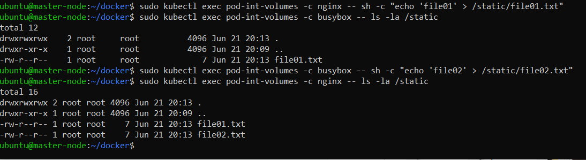
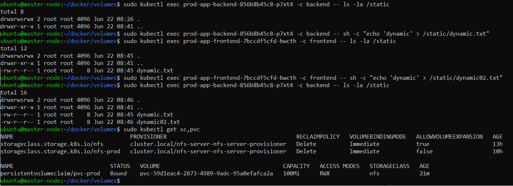

# 13.2 разделы и монтирование

Задание 1: подключить для тестового конфига общую папку
В stage окружении часто возникает необходимость отдавать 
статику бекенда сразу фронтом. Проще всего сделать это через общую папку. Требования:

- в поде подключена общая папка между контейнерами (например, /static);
- после записи чего-либо в контейнере с беком файлы можно получить из контейнера с фронтом.

Манифест:  

[pod_volume.yml](kub_manifest/volumes/pod_volume.yml)
```
kind: Pod
metadata:
  name: pod-int-volumes
spec:
  containers:
    - name: nginx
      image: nginx
      volumeMounts:
        - mountPath: "/static"
          name: my-volume
    - name: busybox
      image: busybox
      command: ["sleep", "3600"]
      volumeMounts:
        - mountPath: "/static"
          name: my-volume
  volumes:
    - name: my-volume
      emptyDir: {}
```
Выводы команд:  




Задание 2: подключить общую папку для прода
Поработав на stage, доработки нужно отправить на прод. В продуктиве у нас контейнеры крутятся в разных подах, поэтому потребуется PV и связь через PVC. Сам PV должен быть связан с NFS сервером. Требования:

- все бекенды подключаются к одному PV в режиме ReadWriteMany;
- фронтенды тоже подключаются к этому же PV с таким же режимом;
- файлы, созданные бекендом, должны быть доступны фронту.


[storage.yml](kub_manifest/volumes/storage.yml)    
```
---
apiVersion: storage.k8s.io/v1
kind: StorageClass
metadata:
  name: nfs-prod
provisioner: cluster.local/nfs-server-nfs-server-provisioner
parameters:
  server: nfs-server
  path: /share
  readOnly: "false"
```

[pvc.yml](kub_manifest/volumes/pvc.yml)    
```
---
apiVersion: v1
kind: PersistentVolumeClaim
metadata:
  name: pvc-prod
spec:
  storageClassName: nfs
  accessModes:
    - ReadWriteMany
  resources:
    requests:
      storage: 100Mi
```

Деплойменты frontend и backend  
[dep_volume.yml](kub_manifest/volumes/dep_volume.yml)

```
---
apiVersion: apps/v1
kind: Deployment
metadata:
  name: prod-app-frontend
  labels:
    app: prod-frontend
spec:

  selector:
    matchLabels:
      app: prod-frontend
  template:
    metadata:
      labels:
        app: prod-frontend
    spec:
      volumes:
      - name: volume01
        persistentVolumeClaim:
          claimName: pvc-prod
      containers:
      - name: frontend
        image: httpd
        ports:
        - containerPort: 80
        volumeMounts:
          - mountPath: "/static"
            name: volume01
  

---
apiVersion: apps/v1
kind: Deployment
metadata:
  name: prod-app-backend
  labels:
    app: prod-backend
spec:
  selector:
    matchLabels:
      app: prod-backend
  template:
    metadata:
      labels:
        app: prod-backend
    spec:
      volumes:
      - name: volume01
        persistentVolumeClaim:
          claimName: pvc-prod   
      containers:
      - name: backend
        image: httpd
        ports:
        - containerPort: 80
        volumeMounts:
          - mountPath: "/static"
            name: volume01
```


Выводы команд:



