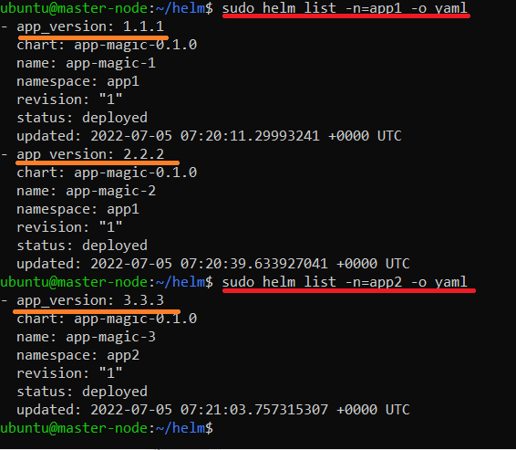

# 13.4 инструменты для упрощения написания конфигурационных файлов. Helm и Jsonnet

Задание 1: подготовить helm чарт для приложения
Необходимо упаковать приложение в чарт для деплоя в разные окружения. Требования:

каждый компонент приложения деплоится отдельным deployment’ом/statefulset’ом;
в переменных чарта измените образ приложения для изменения версии.

- [values.yaml](app-magic/values.yaml)
```
# Default values for app-magic.
# This is a YAML-formatted file.
# Declare variables to be passed into your templates.

replicaCount: 1

images:
  - frontend:
    name: frontend
    repository: httpd
    pullPolicy: IfNotPresent
    # Overrides the image tag whose default is the chart appVersion.
    port: 80
    tag: ""
  - backend:
    name: backend
    repository: bitnami/prometheus
    pullPolicy: IfNotPresent
    # Overrides the image tag whose default is the chart appVersion.
    port: 9090
    tag: ""


service:
  type: ClusterIP 
```

- [deployment.yaml](app-magic/templates/deployment.yaml)
```
{{- range $index, $val := .Values.images }}

---
apiVersion: apps/v1
kind: Deployment
metadata:
  name: {{ $val.name }}-{{ $.Chart.AppVersion | replace "." "-" }}
  labels:
    app: {{ $val.name }}-{{ $.Chart.AppVersion | replace "." "-" }}
spec:
  replicas: {{ $.Values.replicaCount }}
  selector:
    matchLabels:
      app: {{ $val.name }}-{{ $.Chart.AppVersion | replace "." "-" }}
  template:
    metadata:
      labels:
        app: {{ $val.name }}-{{ $.Chart.AppVersion | replace "." "-" }}
    spec:
      containers:
        - name: {{ $val.name }}-{{ $.Chart.AppVersion | replace "." "-" }}
          image: {{ $val.repository }}
          ports:
            - name: http
              containerPort: {{ $val.port }}
              protocol: TCP
          livenessProbe:
            httpGet:
              path: /
              port: http
          readinessProbe:
            httpGet:
              path: /
              port: http
{{- end }}   
```
- [service.yaml](app-magic/templates/service.yaml)

```
{{- range $index, $val := .Values.images }}

---
apiVersion: v1
kind: Service
metadata:
  name: {{ $val.name }}-{{ $.Chart.AppVersion | replace "." "-" }}
  labels:
    app: {{ $val.name }}-{{ $.Chart.AppVersion | replace "." "-" }}
spec:
  type: {{ $.Values.service.type }}
  ports:
    - port: {{ $val.port }}
      targetPort: {{ $val.port }}
      protocol: TCP
  selector:
    app: {{ $val.name }}-{{ $.Chart.AppVersion | replace "." "-" }}
{{- end }}  
```

Задание 2: запустить 2 версии в разных неймспейсах
Подготовив чарт, необходимо его проверить. Попробуйте запустить несколько копий приложения:

- одну версию в namespace=app1;
- вторую версию в том же неймспейсе;
- третью версию в namespace=app2.

Выводы команд:  




