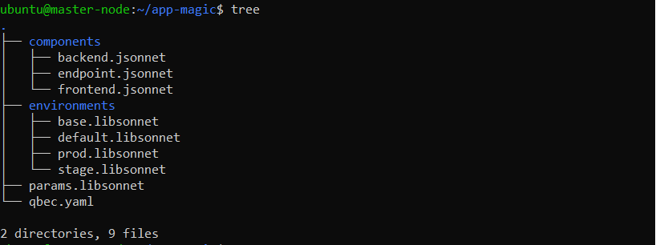
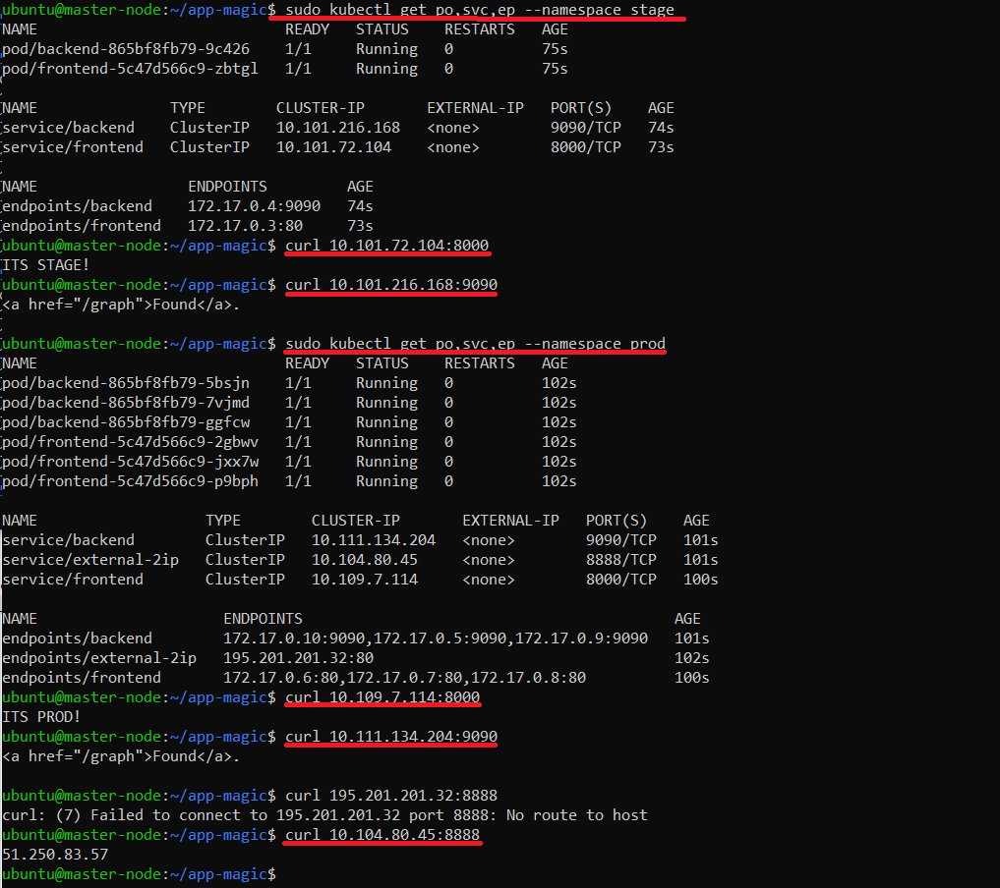

# 13.5 поддержка нескольких окружений на примере Qbec

Задание 1: подготовить приложение для работы через qbec
Приложение следует упаковать в qbec. Окружения должно быть 2: stage и production.

Требования:

stage окружение должно поднимать каждый компонент приложения в одном экземпляре;  
production окружение — каждый компонент в трёх экземплярах;
для production окружения нужно добавить endpoint на внешний адрес.

Выводы команд:  





- [qbec.yaml](app-magic/qbec.yaml)
```
apiVersion: qbec.io/v1alpha1
kind: App
metadata:
  name: app-magic
spec:
  environments:
    stage:
      defaultNamespace: stage
      server: https://192.168.102.26:8443
      excludes:
        - endpoint
    prod:
      defaultNamespace: prod
      server: https://192.168.102.26:8443
  vars: {}
```

- [prod.libsonnet](app-magic/environments/prod.libsonnet)
```
{
  components: {
    frontend: {
      indexData: 'ITS PROD!\n',
      replicas: 3,
    },
    backend: {
      replicas: 3,
    },
  },
}

```

- [stage.libsonnet](app-magic/environments/stage.libsonnet)
```
{
  components: {
    frontend: {
      indexData: 'ITS STAGE!\n',
      replicas: 1,
    },
    backend: {
      replicas: 1,
    },
  },
}
```

- [frontend.jsonnet](app-magic/components/frontend.jsonnet)
```
local p = import '../params.libsonnet';
local params = p.components.frontend;
[
  {
    apiVersion: 'v1',
    kind: 'ConfigMap',
    metadata: {
      name: 'frontend',
    },
    data: {
      'index.html': params.indexData,
    },
  },
  {
    apiVersion: 'apps/v1',
    kind: 'Deployment',
    metadata: {
      name: 'frontend',
      labels: {
        app: 'frontend',
      },
    },
    spec: {
      replicas: params.replicas,
      selector: {
        matchLabels: {
          app: 'frontend',
        },
      },
      template: {
        metadata: {
          labels: {
            app: 'frontend',
          },
        },
        spec: {
          containers: [
            {
              name: 'frontend',
              image: 'nginx:stable',
              volumeMounts: [
                {
                  name: 'web',
                  mountPath: '/usr/share/nginx/html',
                },
              ],
            },
          ],
          volumes: [
            {
              name: 'web',
              configMap: {
                name: 'frontend',
              },
            },
          ],
        },
      },
    },
  },
  {
    apiVersion: 'v1',
    kind: 'Service',
    metadata: {
      name: 'frontend',
      labels: {
        app: 'frontend'
      }
    },
    spec: {
      type: 'ClusterIP',
      ports: [
        {
          targetPort: 80,
          port: 8000
        }
      ],
      selector: {
        app: 'frontend'
      }
    }
  }
] 
```

- [backend.jsonnet](app-magic/components/backend.jsonnet)
```
local p = import '../params.libsonnet';
local params = p.components.backend;
[
  {
    apiVersion: 'apps/v1',
    kind: 'Deployment',
    metadata: {
      name: 'backend',
      labels: {
        app: 'backend',
      },
    },
    spec: {
      replicas: params.replicas,
      selector: {
        matchLabels: {
          app: 'backend',
        },
      },
      template: {
        metadata: {
          labels: {
            app: 'backend',
          },
        },
        spec: {
          containers: [
            {
              name: 'backend',
              image: 'bitnami/prometheus',
            },
          ],
        },
      },
    },
  },
  {
   "apiVersion": "v1",
   "kind": "Service",
   "metadata": {
      "name": "backend",
      "labels": {
         "app": "backend"
      }
    },
   "spec": {
      "type": "ClusterIP",
      "ports": [
         {
            "targetPort": 9090,
            "port": 9090
         }
      ],
      "selector": {
         "app": "backend"
      }
    }
  },
]  
```
- [endpoint.jsonnet](app-magic/components/endpoint.jsonnet)

```
[
    {
       "kind": "Service",
       "apiVersion": "v1",
       "metadata": {
          "name": "external-2ip"
       },
       "spec": {
          "ports": [
             {
                "name": "web",
                "protocol": "TCP",
                "port": 8888,
                "targetPort": 80
             }
          ]
       },
    },

    {
       "kind": "Endpoints",
       "apiVersion": "v1",
       "metadata": {
          "name": "external-2ip"
       },
       "subsets": [
          {
             "addresses": [
                {
                   "ip": "195.201.201.32"
                }
             ],
             "ports": [
                {
                   "port": 80,
                   "name": "web"
                }
             ]
          }
       ]
    }
]
```


